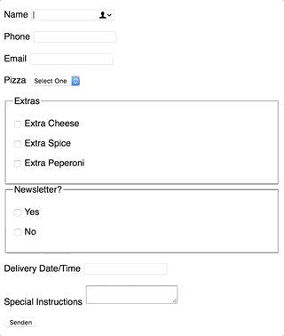

# Focus Highlight

[](https://standardjs.com)
[](./LICENSE.md)

Focus Highlight replaces your native focus outline with an animated one. This can be useful if you can't rely on the native focus outline or if you just want to have a nice animation.




## How to use

Install via NPM:
```bash
npm install focus-highlight
```

Import Focus Highlight with the JS-Bundler of your choice:
```javascript
import FocusHighlight from 'focus-highlight'
```

Initialize Focus Highlight after you finish loading the page:
```javascript
FocusHighlight.init()
```

Focus Highlight comes with default settings which can be changed:
```javascript
FocusHighlight.init({
  borderRadius: 4,
  borderThickness: 2,
  padding: 0,
  color: "blueViolet",
  transitionDuration: 0.3,
  transitionTimingFunction: 'ease-in-out',
  customStyle: false
})
```
Set `customStyle: true` if you completely want to roll with your own CSS.

## Known Limitations

Firefox comes with its own custom outline, `outline: none;` is not enough unfortunately. You have to style each form element in order to get rid of them.

## Alternatives

[Flying Focus](https://github.com/NV/flying-focus) offers a similiar solution and even comes with a browser extension, if this is what you looking for.

## License

[MIT](./LICENSE.md)